```{r setup, include=FALSE}
knitr::opts_chunk$set(echo = TRUE,
                      warning = FALSE, message = FALSE)
```
# 데이터사이언스를 위한 통계학입문 I

## 2. 데이터 과학과 통계 - 빅데이터 탐색의 첫걸음  
  
### 2-1. 빅데이터 탐색의 첫걸음 - 데이터의 평균(중심위치)  

- 평균은 요약된 정보 : 평균은 데이터를 **하나의 값** 으로 표현한 요약된 정보 **(추정치)!**  
- 전과목의 평균 = (국어점수 + 수학점수 +...+ 국사점수)/9 (과목수)  
- 네덜란드 성인남자 평균키 = 네덜란드 성인남자들 키 총합 / 조사대상자 수  
- **평균 = 데이터 값의 총 합 / 데이터 개수** 
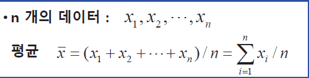   
- 평균은 **혼자 존재하는 개념**이 아니다!  

### 평균을 다룰 때 주의할 점 - 평균과 표본산정   
- 어떻게 **표본선정을 하느냐**에 따라 평균값에 영향을 미친다.  
ex) 대기업의 평균연봉을 알아보기 위해 표본 200명을 선정 
  
- 조사된 평균값이 **모집단을 대표하는 통계치라고 할 수 있나?**  
- 표본이 적합하게 추출되었는지 평가하는 방법(평균을 예제로 하면)  
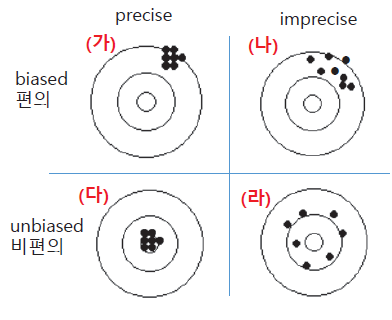   
```
    + 1. **편의가(Bias)가 적은가?** : 표본을 추출할 때 표본으로부터 얻어지는 통계치(표본평균)의 기대값이 모수의 참값과 유사한가? 
    + 2. **정확도(Precision)가 높은가?** : 반복해서 표본을 추출할 때 (반복 실험할 때) 얼마나 유사한 값들이 나오는 가?  
```  
- 같은 평균이라도 분산이 다르면 데이터 특성은 다르다! 
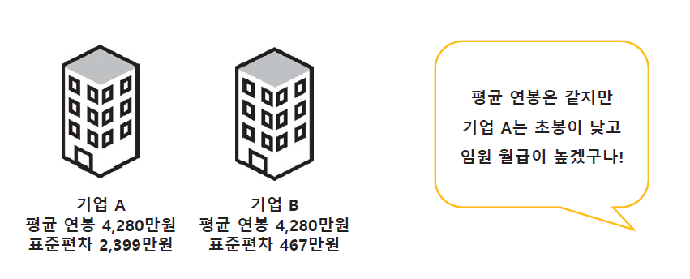   
### 평균을 다룰 때 주의할 점  
- 평균값은 그 집단에서 **가장 많이 존재하는 값**이 아니다! 
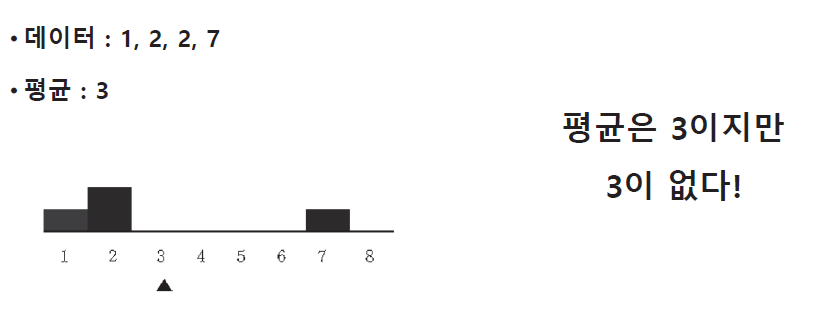  
- 평균(mean)은 표본이 적은 경우 아주 큰 값이나 작은 값(outlier)에 민감한 추정치. 떄로는 중앙값이 평균보다 더 적합한 중심척도인 경우도 있음  
```
- 중앙값(median)  
   + n개의 관측치를 크기순으로 배열했을 때 중앙의 위치에 놓이게 되는 값  
   + 데이터의 수가 작고 이상치(outlier)가 있을 때 평균보다 더 정확한 모집단의 중심값이 됨  
- 최빈값(mode)  
   + 전체 데이터 중 가장 빈도(frequency)가 높은 값
   + 데이터의 수가 많아질 수록 평균과 가까워짐  
```
## 2-2. 빅데이터 탐색의 첫걸음 - 데이터의 분산 (산포정도) -  
- 데이터는 아는 만큼 보인다.  
- 평균만 아는 사람 vs 평균과 표준편차를 아는 사람 
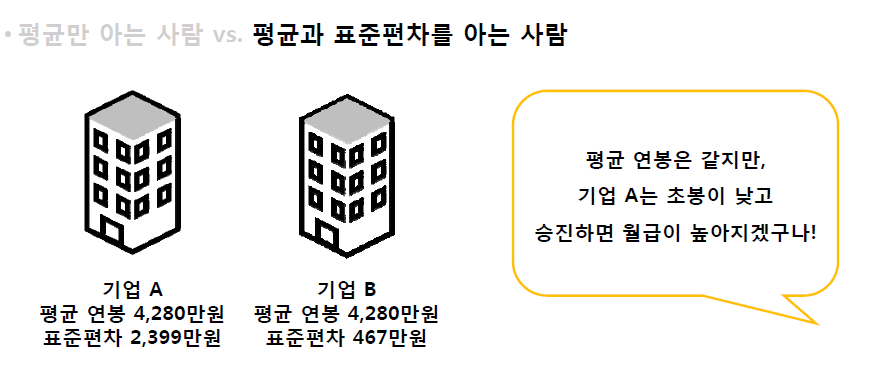  
- 연봉의 히스토그램을 그려보자! (계급구간 너비 = 150만원)   
- 기업 A는 **양극단**에 분포, 기업 B는 **평균 중심**에 많이 분포 -> 기업 A의 **산포정도(분산)가 더 큼**  
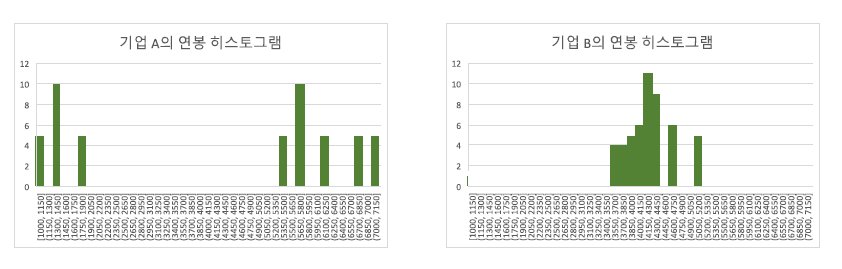   
- 초록색의 분산이 가장 크고 노란색의 분산이 가장 작네! 
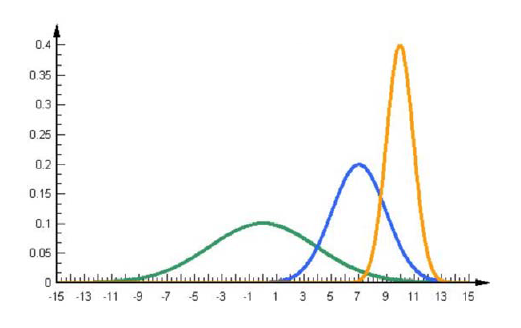   
### 분산의 공식  
- 데이터의 산포 정도가 크다.  
    + = 데이터가 중간에 몰려있지 않고 멀리 퍼져있다. 
    + = 데이터가 중심위치로부터 멀리 퍼져있다. 
    + = 데이터가 **평균과 데이터들의 차이**가 크다!  
- 데이터의 평균과 데이터들의 거리의 합으로 분산을 계산!  
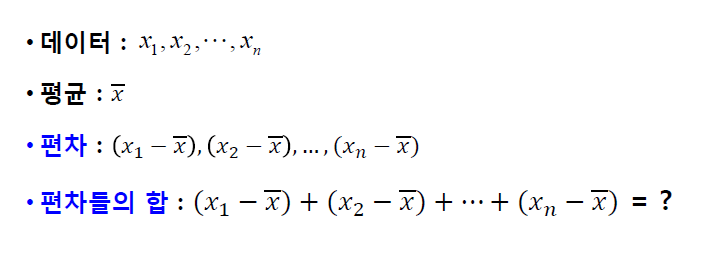   
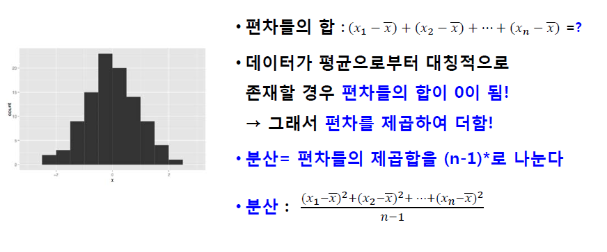  
* (n-1)로 나누는 이유는 자유도와 관련, 평균값으로 표본평균을 사용하므로 1개의 자유도를 잃게되서 (n-1)로 나눈다.  
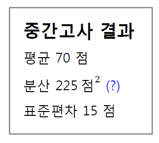  
- (개별데이터값-평균값)의 차이를 제곱하여 더하였으므로 값이 커지고, 단위가 달라짐  
→ 분산에 제곱근을 취하여 원래 단위로 복원  

→ 이를 표준편차라고 부름   
- 분산은 데이터가 분포되어있는 정도  
+  
데이터에 대한 요약 정보를 보완해줌 !   
평균값만으로 데이터를 상상해보기 어려움!  
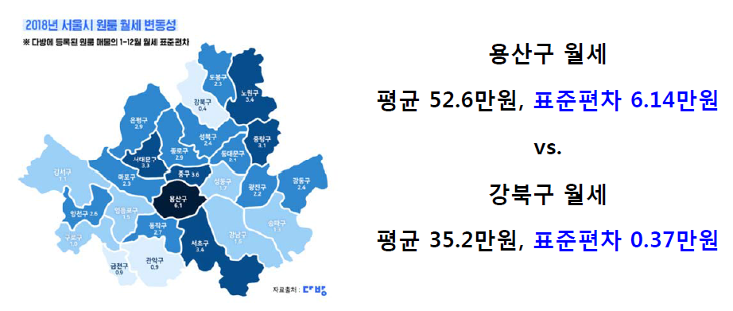  
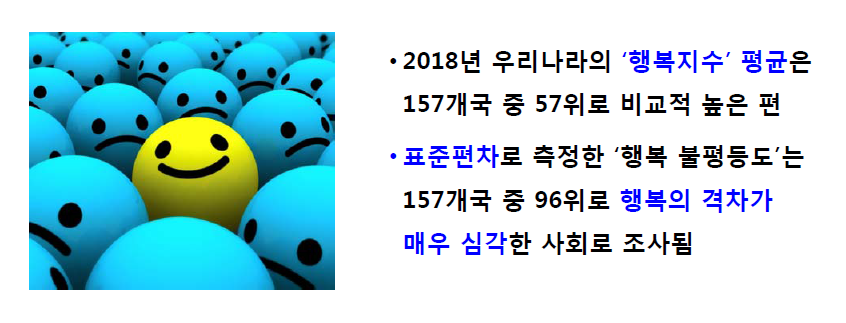 